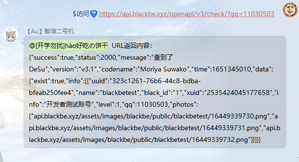

# api_tester

## 简介

此插件用于快捷获取 API 返回值或者返回图片

## 指令

- `$访问 <URL>`

  **该指令只有`SUPERUSER`能触发**  
  获取指定 URL 返回的内容

  - 示例  
    

- `$img <URL>`

  **该指令只有`SUPERUSER`能触发**  
  获取指定 URL 返回的图片

  - 示例  
    

## 配置

无

## 更新日志

- 0.1.0: initial
